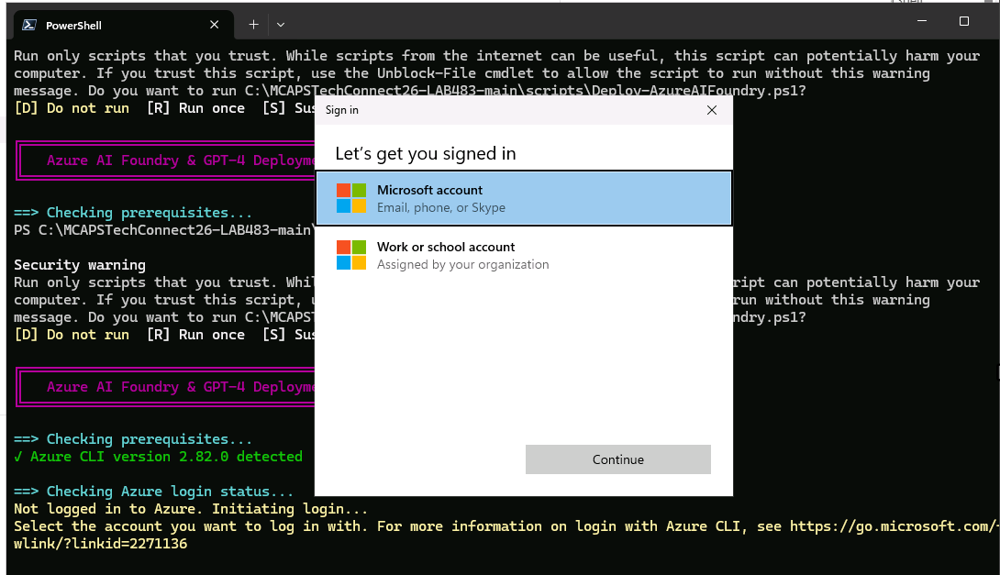
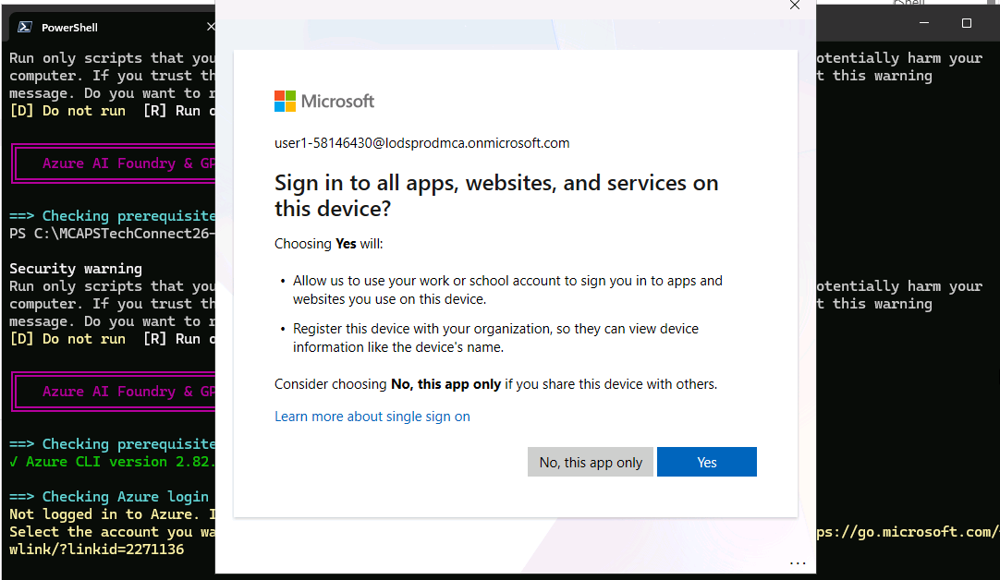
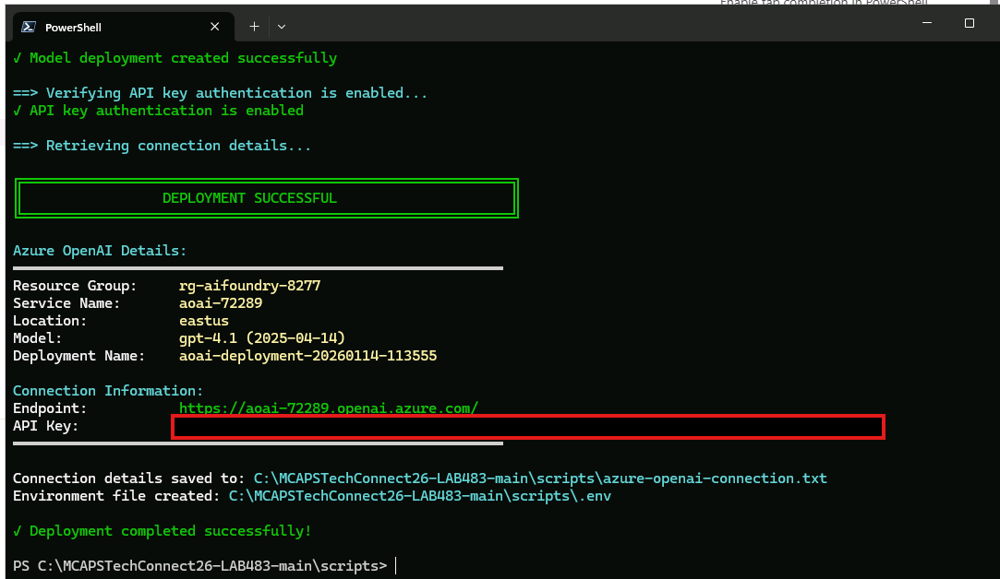

# Prerequisites

In this lab you will build, test, and deploy as custom engine agent you will develop using the Microsoft 365 Agents SDK and Agents Framework throughout this path.

> [!Alert] These samples and labs are intended for instructive and demonstration purposes and are not intended for use in production. Do not put them into production without upgrading them to production quality.

## Exercise 1 : Setup Microsoft Teams

By default, end users can't upload applications directly; instead a Teams administrator needs to upload them into the enterprise app catalog. The demo tenant in the lab environment has been pre-configured to allow users to upload custom apps.

## Exercise 2: Setup Development Environment

You can complete these labs on a Windows, macOS, or Linux machine. Below you can find the list of the required tools, which have already been installed in hte lab environment for you:

- Visual Studio Code
- .NET 9 SDK
- C# Dev Kit Extension
- Microsoft 365 Agents Toolkit Extension
- Azure CLI
- DevTunnel

## Exercise 3: Setup Azure Environment

To complete the exercises in this path, you'll need an Azure subscription to create Microsoft Foundry resources and deploy AI models.
The lab comes with a script that will take care of deploying the required resources for you.
Here are the steps to follow:

1. Click on the Terminal icon which is pinned in the taskbar
2. Type the following command to navigate to the lab folder:

    +++cd C:\MCAPSTechConnect26-LAB483-main\scripts+++

3. Type the following command to launch the script:

    +++.\Deploy-AzureAIFoundry.ps1+++

4. For security reasons, you will be asked a confirmation to proceed with the script execution. Type **R** and press Enter.
5. After checking that the Azure CLI is installed, the script will prompt you to login to your Azure account. 

    

6. Choose **Work or school account** and click **Continue**.
7. Use the following credentials and press Sign in:

    - Username: +++@lab.CloudPortalCredential(User1).Username+++
    - Temporary Access Pass: +++@lab.CloudPortalCredential(User1).TAP+++
8. You will be asked if you want to sign in to all apps, websites, and services on this device. Choose **No, this app only**.

    

9. After the sign in is completed, the script will ask you to choose one of the available Azure subscriptions. There will be only one, so type **1** and press Enter.
10. The script will now continue the execution and create a new resource group on Azure with an Azure OpenAI resource in it. Once the script is completed, you will see a summary of the created resources.

    

    The script will also create a file called **azure-resources.txt** with the same summary for your reference.
    You will need them later to properly configure the agent.

You have completed Lab BAF0 - Prerequisites!

You are now ready to proceed to Lab BAF1 - Build and Run Your First Agent. Select Next.