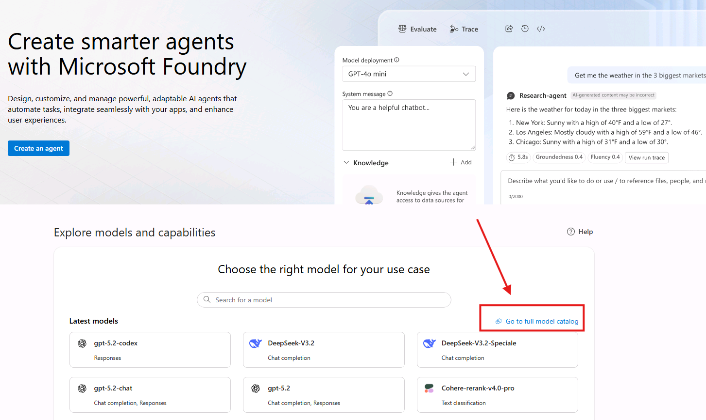
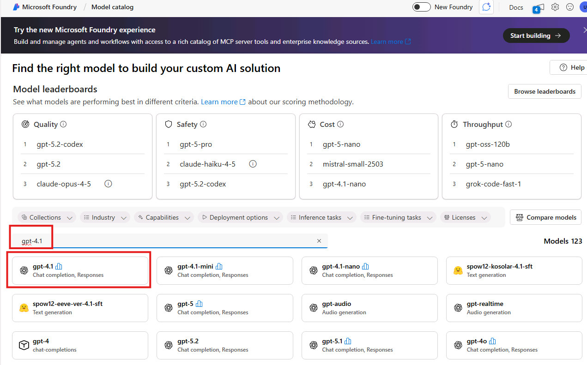
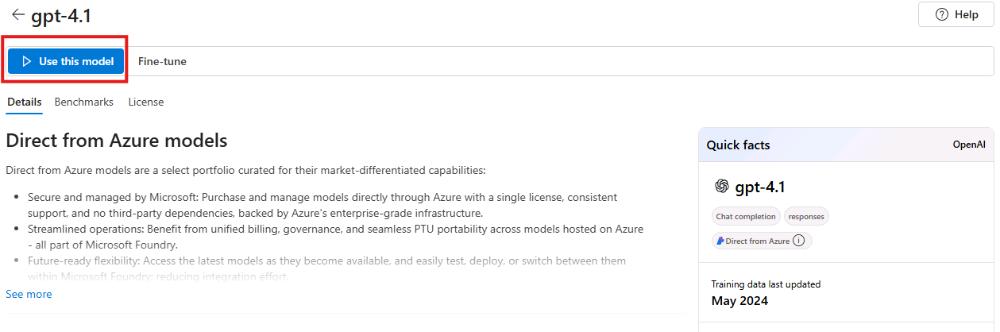
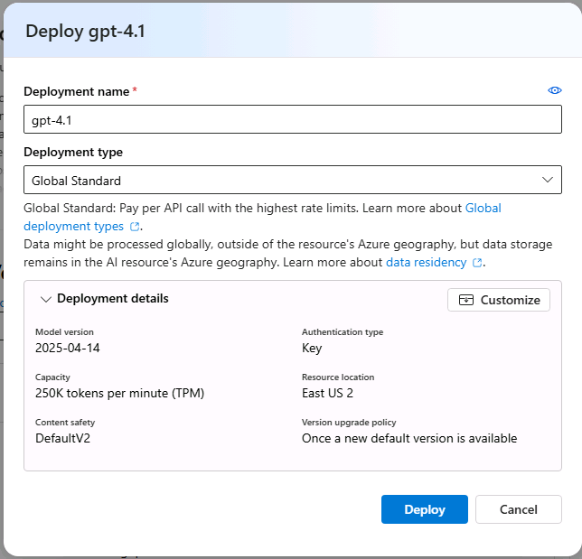
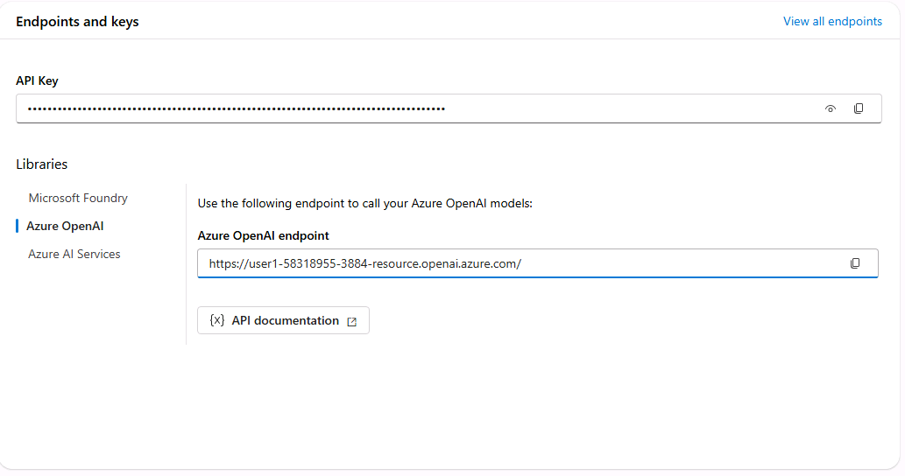

# Prerequisites

In this lab you will build, test, and deploy as custom engine agent you will develop using the Microsoft 365 Agents SDK and Agents Framework throughout this path.

> [!Alert] These samples and labs are intended for instructive and demonstration purposes and are not intended for use in production. Do not put them into production without upgrading them to production quality.

## Exercise 1 : Setup Microsoft Teams

By default, end users can't upload applications directly; instead a Teams administrator needs to upload them into the enterprise app catalog. The demo tenant in the lab environment has been pre-configured to allow users to upload custom apps.

## Exercise 2: Setup Development Environment

You can complete these labs on a Windows, macOS, or Linux machine. Below you can find the list of the required tools, which have already been installed in the lab environment for you:

- Visual Studio Code
- .NET 9 SDK
- C# Dev Kit Extension
- Microsoft 365 Agents Toolkit Extension
- Azure CLI
- DevTunnel

## Exercise 3: Setup Azure Environment

To complete the exercises in this path, you'll need an Azure subscription to create Microsoft Foundry resources and deploy AI models. The lab environment comes with an Azure subscription pre-configured for you with the following credentials:

- **Username**: +++@lab.CloudPortalCredential(User1).Username+++
- **Temporary Access Pass**: +++@lab.CloudPortalCredential(User1).TAP+++
  
Use them every time you are prompted to sign in to Azure or to Microsoft Foundry during the labs.

### Step 1: Create Microsoft Foundry Project and Deploy Model

For this lab path, you'll need a Microsoft Foundry project with a deployed language model.

1️⃣ Open Edge in the lab environment and navigate to the Microsoft Foundry portal by typing the following URL in the address bar: +++https://ai.azure.com+++, then sign in with your Azure account.

2️⃣ In the middle of the page you'll find a section called **Models and experiences**. Inside it, click on the **Go to full model catalog** link.

3️⃣ Using the integrated search bar, look for the **gpt-4.1** model and click on it.

4️⃣ From the top bar, choose **Use this model**.

5️⃣ You will be asked to choose a project. Click on the dropdown and pick **Create a new project**.

6️⃣Leave the project name as recommended and select **Create and continue**. This will scaffold a new project for you in Microsoft Foundry, it usually takes 3-5 minutes. 

7️⃣ Once your project is created, you will be asked to specify a deployment name and type. Leave the default settings and click **Deploy**.

> [!Alert] **Model Selection**
> Please use **gpt-4.1** for a smooth experience . The labs use knowledge base answer synthesis which is optimized for gpt-4.1. Using other models may lead to unexpected behavior.

**Save Your Credentials**

In order to get the information you need to connect your agent to the model, click on **Overview** in the left sidebar and focus on the section called **Endpoints and keys**.

1. To get the **Endpoint URL** you will need in the project, click on **Azure OpenAI** under **Libraries** and note down the **AzureOpenAI endpoint**. It will look something like **https://user1-58318955-3884-resource.openai.azure.com/**.
2. The **API Key** is listed in section, at the top.
3. The **Model Deployment Name** is the name you gave to your gpt-4.1 deployment, which by default is **gpt-4.1**.

Save these values in a secure location - you'll need them in the next lab!

> [!Hint] **Additional services**
> You'll create other Azure services (like Azure AI Search) in later labs when you need them.

### Step 3: Configure Content Safety Filter

The insurance domain uses terms like "injury", "collision", "damage" that may trigger default content filters. You need to create a custom content filter with lower thresholds.

1️⃣ In Microsoft Foundry, navigate to your project.

2️⃣ In the left sidebar, select **Guardrails + Controls** → **Content filters**.

3️⃣ Click **+ Create content filter**.

4️⃣ Name your filter +++InsuranceLowFilter+++.

5️⃣ Configure the following settings for **Input filters** (what users send):

- **Violence**: Set threshold to **Low**
- **Hate**: Set threshold to **Low**
- **Sexual**: Set threshold to **Low**
- **Self-harm**: Set threshold to **Low**
- Prompt shields for jailbreak attacks: Off
- Prompt shields for indirect attacks: Off

6️⃣ Select **Next** and configure the same settings for **Output filters** (what AI generates):

- **Violence**: Set threshold to **Low**
- **Hate**: Set threshold to **Low**
- **Sexual**: Set threshold to **Low**
- **Self-harm**: Set threshold to **Low**
- Protected material for text: Off
- Protected material for code: Off
- Groundedness (Preview): Off

7️⃣ Select **Next**.

8️⃣ In Apply filter to deployments, select your **gpt-4.1** deployment.

9️⃣ Select **Replace** to apply the new filter to the deployment.

🔟 Finally, select **Create filter**.

> [!Knowledge]  **Why This Is Needed**
> Insurance claims contain legitimate terms like "injury", "accident", "collision", "bodily harm" that describe real incidents. Default content filters may block these terms. Setting thresholds to **Low** only blocks extreme content while allowing normal insurance terminology.

> [!Hint] **Production Deployments**
> In production, review your organization's content safety policies and adjust filter settings accordingly. This configuration is for development and testing purposes.

You have completed the prerequisites!

You are now ready to proceed to the next exercise - Build and Run Your First Agent. Select Next.