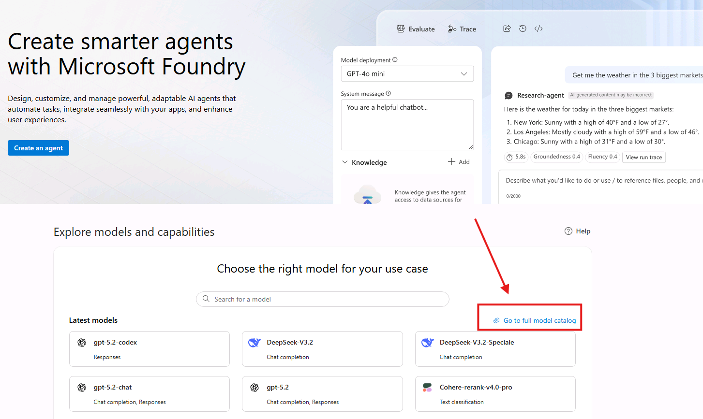
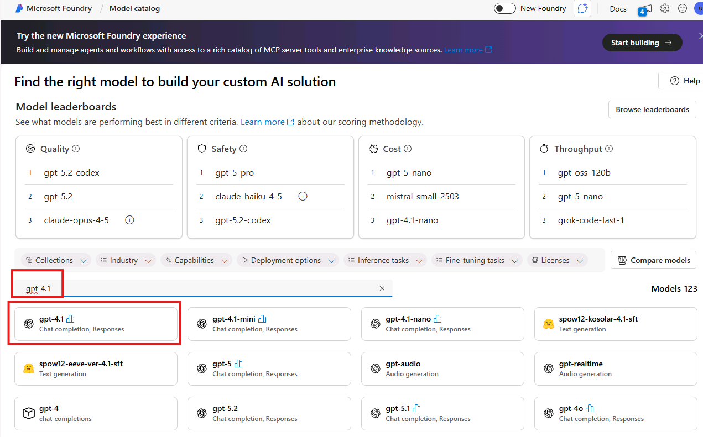
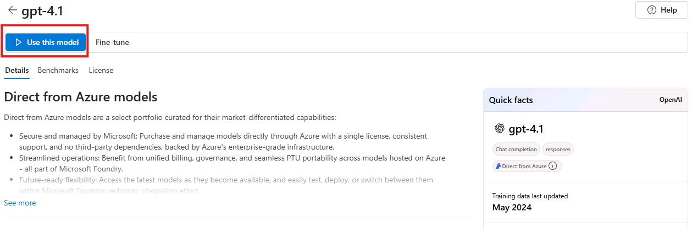
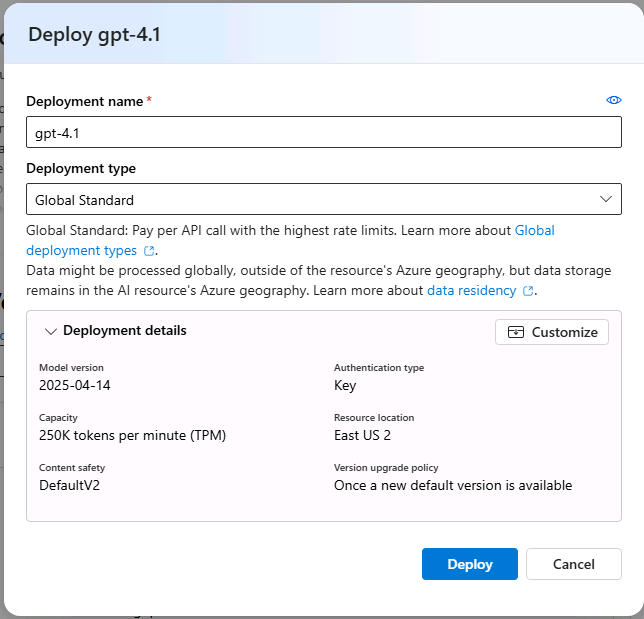
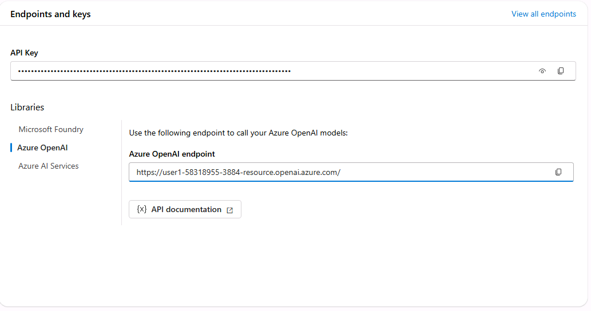

# Module 00: Prerequisites

In this lab you will build, test, and deploy as custom engine agent you will develop using the Microsoft 365 Agents SDK and Agents Framework throughout this path.

> [!Alert] These samples and labs are intended for instructive and demonstration purposes and are not intended for use in production. Do not put them into production without upgrading them to production quality.

## Exercise 1 : Setup Microsoft Teams

By default, end users can't upload applications directly; instead a Teams administrator needs to upload them into the enterprise app catalog. The demo tenant in the lab environment has been pre-configured to allow users to upload custom apps.

## Exercise 2: Setup Development Environment

You can complete these labs on a Windows, macOS, or Linux machine. Below you can find the list of the required tools, which have already been installed in the lab environment for you:

- Visual Studio Code
- .NET 9 SDK
- C# Dev Kit Extension
- Microsoft 365 Agents Toolkit Extension
- Azure CLI
- DevTunnel

## Exercise 3: Setup Azure Environment

To complete the exercises in this path, you'll need an Azure subscription to create Microsoft Foundry resources and deploy AI models. The lab environment comes with an Azure subscription pre-configured for you you will be provided the credentials as needed:

Log into your lab desktop:

- **Username** +++Labuser+++
- **Password** +++@lab.VirtualMachine(Win11-Pro-Base).Password+++

<!-- - **Username**: +++@lab.CloudPortalCredential(User1).Username+++
- **Temporary Access Pass**: +++@lab.CloudPortalCredential(User1).TAP+++ -->
  
Use them every time you are prompted to sign in to Azure or to Microsoft Foundry during the labs.

### Step 1: Create Microsoft Foundry Project and Deploy Model

For this lab path, you'll need a Microsoft Foundry project with a deployed language model.

1. [] Open Edge in the lab environment and navigate to the Microsoft Foundry portal by typing the following URL in the address bar: +++https://ai.azure.com+++.

1. [] In the top right, select **Sign in** then sign in with your Azure account.

    - **Username**: +++@lab.CloudPortalCredential(User1).Username+++
    - **Temporary Access Pass**: +++@lab.CloudPortalCredential(User1).TAP+++

1. [] In the middle of the page you'll find a section called **Explore models and capabilities**. Inside it, click on the **Go to full model catalog** link.

1. [] Using the integrated search bar, look for the +++gpt-4.1+++ model and click on it.

1. [] From the top bar, choose **Use this model**.

1. [] You will be asked to choose a project. Click on the dropdown and pick **Create a new project**.

1. [] For the project name, enter +++User1-@lab.LabInstance.Id+++

1. [] Below the Project name, select **Advanced options**

1. [] For the Resource group, select **ResourceGroup1** in the dropdown.

1. [] For the Region, select **@lab.CloudResourceGroup(ResourceGroup1).Location**

    >[!Note] If the step above says to use West US2 and you receive an error, please select another region.

1. [] Select **Create and continue**.

    >[!Note] Make sure to use the exact configuration described above (project name, resource group, etc.). If you change anything, the policies applied to the machine will block the creation of the resource.
    >[!Note] This will scaffold a new project for you in Microsoft Foundry, it usually takes 3-5 minutes.

1. [] Once your project is created, you will be asked to specify a deployment name and type. Leave the default settings and click **Deploy**.

> [!Alert] **Model Selection**
> Please use **gpt-4.1** for a smooth experience . The labs use knowledge base answer synthesis which is optimized for gpt-4.1. Using other models may lead to unexpected behavior.

#### Save Your Credentials

1. [] In order to get the information you need to connect your agent to the model, click on **Overview** in the left sidebar and focus on the section called **Endpoints and keys**.

1. [] Below Endpoints and keys -> Libraries, select **Azure OpenAI**

1. [] Select the copy button to the right of the **Azure OpenAI endpoint** and then paste it into the text box below. It will look something like **https://user1-58318955-3884-resource.openai.azure.com/**.

    @lab.TextBox(OpenAIEP)

1. [] Select the copy button to the right of the **API Key** and then paste it into the text box below.

    @lab.TextBox(OpenAIAPIKey)

   >[!Note] Make sure to use the Azure OpenAI endpoint, not the Microsoft Foundry one, otherwise the agent won't work.

<!-- 1. [] The **Model Deployment Name** is the name you gave to your gpt-4.1 deployment, which by default is **gpt-4.1**. -->

> [!Hint] **Additional services**
> You'll create other Azure services (like Azure AI Search) in later labs when you need them.

### Step 3: Configure Content Safety Filter

The insurance domain uses terms like "injury", "collision", "damage" that may trigger default content filters. You need to create a custom content filter with lower thresholds.

<!-- 1. [] In Microsoft Foundry, navigate to your project. -->

1. [] In the left sidebar, select **Guardrails + Controls** -> **Content filters**.

1. [] Click **+ Create content filter**.

1. [] Name your filter +++InsuranceLowFilter+++.

1. [] Select Next and then configure the following settings for **Input filters** (what users send):

    >[!Hint] If the screen is too small, you might not see the entire setting bar. Please zoom out or navigate to the right of the screen to find the options mentioned below.

    - **Violence**: Set threshold to **Lowest**
    - **Hate**: Set threshold to **Lowest**
    - **Sexual**: Set threshold to **Lowest**
    - **Self-harm**: Set threshold to **Lowest**
    - Prompt shields for jailbreak attacks: Off
    - Prompt shields for indirect attacks: Off

1. [] Select **Next** and configure the same settings for **Output filters** (what AI generates):

    - **Violence**: Set threshold to **Lowest**
    - **Hate**: Set threshold to **Lowest**
    - **Sexual**: Set threshold to **Lowest**
    - **Self-harm**: Set threshold to **Lowest**
    - Protected material for text: Off
    - Protected material for code: Off
    - Groundedness (Preview): Off

1. [] Select **Next**.

1. [] In Apply filter to deployments, select your **gpt-4.1** deployment.

1. [] Select **Replace** to apply the new filter to the deployment.

1. [] Finally, select **Create filter**.

> [!Knowledge]  **Why This Is Needed**
> Insurance claims contain legitimate terms like "injury", "accident", "collision", "bodily harm" that describe real incidents. Default content filters may block these terms. Setting thresholds to **Low** only blocks extreme content while allowing normal insurance terminology.
> [!Hint] **Production Deployments**
> In production, review your organization's content safety policies and adjust filter settings accordingly. This configuration is for development and testing purposes.

Congratulations! You have completed the prerequisites!

You are now ready to proceed to the next exercise - Build and Run Your First Agent. **Select Next**.
