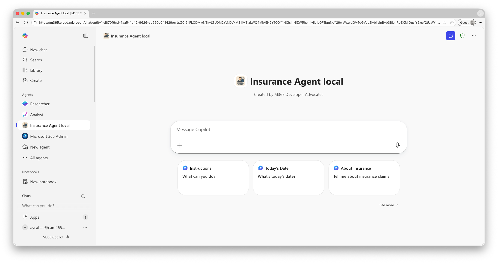

# Module 1 - Build and Run Your First Agent

In this lab, you'll build and run a custom engine agent using the **Microsoft 365 Agents SDK** with the **Agents Framework**. You'll explore the starter project, understand the core components, and see your agent come to life in Microsoft 365 Copilot.

The Zava Insurance Agent is designed to help insurance adjusters streamline claims processing. In this initial lab, you'll start with a basic conversational agent that can greet users and provide information using AI-powered responses.

> [!Knowledge] **What are the Microsoft 365 Agents SDK and Agents Framework?**
> **Microsoft 365 Agents SDK** provides the container and scaffolding to deploy agents across Microsoft 365 channels (Teams, Copilot, etc.), handling activities, events, and communication. It's AI-agnostic, allowing you to use any AI services you choose.
> **Agents Framework** is an open-source development kit for building AI agents with LLMs, tool calling, and multi-agent workflows. It's the successor to Semantic Kernel and AutoGen, providing the AI capabilities and agent logic.
> Together, they allow you to build intelligent agents with the Agents Framework and deploy them to Microsoft 365 using the Agents SDK.

## Exercise 4: Clone and Explore the Project

In this exercise, you'll clone the Copilot Camp repository and explore the starter project structure to understand how the agent is organized.

### Step 1: Clone the Repository

Let's start by cloning the lab repository and navigating to the Agent Framework starter project.

1. [] Open a terminal or command prompt.

1. [] Type the following command to move into the C: folder:

    ```bash
    cd C:\
    ``` 

1. [] Clone the repository:

    ```bash
    git clone https://github.com/microsoft/MCAPSTechConnect26-LAB483.git
    cd MCAPSTechConnect26-LAB483/src/agent-framework/begin
    ```

1. [] Open the project in Visual Studio Code:

    ```bash
    code .
    ```

    >[!Alert] If you get a security pop-up, click on **Yes, I trust the authors** to continue.

### Step 2: Explore the Project Structure

Let's understand the organization of the agent project.

1. [] In Visual Studio Code, expand the folders in the Explorer view. You should see this structure:

    ```
    begin/
    ├── src/
    │   ├── Agent/
    │   │   └── ZavaInsuranceAgent.cs       # Main agent implementation
    │   ├── Plugins/                        # Custom plugins (tools) for the agent
    │   │   ├── StartConversationPlugin.cs  # Welcome message plugin
    │   │   └── DateTimeFunctionTool.cs     # Date/time utility
    ├── appPackage/                         # Teams app manifest and icons
    ├── env/                                # Environment configuration files (API keys, endpoints)
    ├── infra/                              # All required scripts, data and templates for the agent's infrastructure
    ├── Program.cs                          # Application entry point - configures services and starts web app
    ├── InsuranceAgent.csproj               # Project file
    └── m365agents.local.yml                # M365 Agents provisioning config
    ```


### Step 3: Understand the Agent Implementation

Let's examine the main agent file to understand how it works.

1. [] Open **src/Agent/ZavaInsuranceAgent.cs** in Visual Studio Code.

1. [] Find the **AgentInstructions** property near the top of the class. Notice how these instructions act as the **system prompt** for the AI model:

    - It defines the agent's role: "You are a professional insurance claims assistant for Zava Insurance..."
    - It lists available tools using the **{{PluginName.FunctionName}}** syntax
    - It includes **{{StartConversationPlugin.StartConversation}}** and **{{DateTimeFunctionTool.getDate}}**

    >[!Note] These instructions tell the AI how to behave and what tools it can use.

1. [] Scroll down and find the **constructor** method **ZavaInsuranceAgent(...)**. Notice it sets up event handlers:

    - **OnConversationUpdate(ConversationUpdateEvents.MembersAdded, WelcomeMessageAsync)** - sends a welcome message when a user joins
    - **OnActivity(ActivityTypes.Message, OnMessageAsync)** - handles incoming messages

1. [] Find the **GetClientAgent** method. Look for where it creates **toolOptions** and registers plugins:

    - It creates a **ChatOptions** object with a **Tools** list
    - It adds **startConversationPlugin.StartConversation** using **AIFunctionFactory.Create**
    - It adds **DateTimeFunctionTool.getDate** the same way

This is where we register **plugins** (tools) that the AI can call during conversations.

### Step 4: Explore the Plugins

Now let's look at how plugins work.

1. [] Open **src/Plugins/StartConversationPlugin.cs**.

1. [] Notice the plugin structure:

    ```csharp
    public class StartConversationPlugin
    {
        [Description("Starts a new conversation suggesting a conversation flow.")]
        public async Task<string> StartConversation()
        {
            var welcomeMessage = "👋 Welcome to Zava Insurance Claims Assistant!...";
            return welcomeMessage;
        }
    }
    ```

    Key points:

    - The **[Description]** attribute tells the AI **when to use this tool**
    - The method returns a formatted welcome message
    - It's a simple plugin with no parameters

1. [] Open **src/Plugins/DateTimeFunctionTool.cs**.

1. [] Notice how it provides current date/time:

    - It has a **[Description]** that says "Gets the current date and time"
    - The **getDate()** method is static and returns **DateTime.Now** as a formatted string

This plugin demonstrates how the agent can access system information to answer user queries.

### Step 5: View the App Manifest and Conversation Starters

Let's check the app manifest to see how your agent appears in Microsoft 365 Copilot.

1. [] Open **appPackage/manifest.json**.

1. [] Find the **name** section to see your agent's display name:

    ```json
    "name": {
        "short": "${{APP_DISPLAY_NAME}} ${{APP_NAME_SUFFIX}}",
        "full": "${{APP_DISPLAY_NAME}}: Agent for Insurance claims processing and management."
    },
    ```

    >[!Note] Notice the placeholders (like `${{APP_DISPLAY_NAME}}`): during the first deployment of the agent, the Microsoft 365 Agents Toolkit will create a copy of this manifest file and replace the placeholders with the actual values coming from the registration of the agent.

1. [] Scroll down to the **commandLists** array. These are the suggested prompts users see when they first interact with your agent:

    ```json
    "commandLists": [
        {
            "title": "Instructions",
            "description": "What can you do?"
        },
        {
            "title": "Today's Date",
            "description": "What's today's date?"
        },
        {
            "title": "About Insurance",
            "description": "Tell me about insurance claims"
        },
        {
            "title": "Claims Process",
            "description": "Explain how claims processing works"
        }
    ]
    ```

>[!Note] These conversation starters help guide users on how to interact with your agent. You can customize these to match your agent's capabilities.

>[!Note] Notice the **copilotAgents** section that defines your agent as a custom engine agent with specific capabilities.

### Step 6: Review the Application Entry Point

Let's see how everything comes together in Program.cs.

1. [] Open **Program.cs**.

1. [] Key sections to understand:

**Configuration Loading**: Find the section where **builder.Configuration** loads settings. Notice it loads from multiple sources:

- **.env** files for environment-specific settings using **AddEnvFile**
- User secrets for sensitive data (API keys) using **AddUserSecrets**
- Environment variables using **AddEnvironmentVariables**

**Service Registration**: Find where services are registered with **builder.Services**. Notice:

- **AddSingleton<IStorage, MemoryStorage>()** - registers memory storage for conversation state
- **AddAgentApplicationOptions()** - registers agent configuration
- **AddAgent<ZavaInsuranceAgent>()** - registers the agent itself as a service

**Chat Client Configuration**: Find where **IChatClient** is registered as a singleton. Observe how it:

- Retrieves the endpoint, API key, and deployment name from configuration
- Creates an **AzureOpenAIClient** with the endpoint and credentials
- Returns a chat client for the specified deployment (gpt-4.1)

This creates the connection to Azure OpenAI, which powers the agent's AI capabilities.

## Exercise 5: Configure the Agent

Before running the agent, you need to configure it with your Azure AI credentials.

### Step 1: Configure Environment Files

The agent uses environment files to store configuration. Let's set them up.

1. [] In Visual Studio Code, navigate to the **env/** folder.

1. [] You should see two sample files:

    - **.env.local.sample**
    - **.env.local.user.sample**

1. [] Return to your command window and copy **.env.local.sample** to **.env.local** by running the following command:

    ```powershell
    Copy-Item env/.env.local.sample env/.env.local
    ```

1. [] Copy **.env.local.user.sample** to **.env.local.user** by running the following command:

    ```powershell
    Copy-Item env/.env.local.user.sample env/.env.local.user
    ```

### Step 2: Add Your Azure AI Credentials

Now let's configure the agent to use your Azure AI Foundry deployment.

1. [] Open **env/.env.local** in Visual Studio Code.

1. [] Find the **MODELS_ENDPOINT=REPLACE_WITH_AI_FOUNDRY_ENDPOINT_URL** line replace it with the text below:

    ```bash
    MODELS_ENDPOINT=@lab.Variable(OpenAIEP)
    ```

1. [] Open **env/.env.local.user** in Visual Studio Code.

1. [] Find the **SECRET_MODELS_API_KEY=REPLACE_WITH_YOUR_API_KEY** line replace it with the text below:

    ```bash
    SECRET_MODELS_API_KEY=@lab.Variable(OpenAIAPIKey)
    ```

> [!Alert] **Keep Your API Key Secret**
The **.env.local.user** file contains sensitive information and is already included in **.gitignore**. Never commit this file to source control!

### Step 3: Sign in to Microsoft 365 and Azure

The Microsoft 365 Agents Toolkit needs to authenticate with both Microsoft 365 and Azure.

1. [] In Visual Studio Code, click on the **Microsoft 365 Agents Toolkit** icon in the Activity Bar (left side).

1. [] In the toolkit panel, find the **ACCOUNTS** section.

1. [] Click **Sign in to Microsoft 365** and complete the sign-in flow.

    - **Username**: +++@lab.CloudPortalCredential(User1).Username+++
    - **Temporary Access Pass**: +++@lab.CloudPortalCredential(User1).TAP+++

1. [] Click **Sign in to Azure** and complete the sign-in flow.

    - **Username**: +++@lab.CloudPortalCredential(User1).Username+++
    - **Temporary Access Pass**: +++@lab.CloudPortalCredential(User1).TAP+++

> [!Note] **Sign-in to this app only**
> The first time you sign in, Windows might ask you if you want to sign in to all apps, websites and services on this device. Choose **No, this app only**.

> [!Note] **First Time Sign-In**
> The first time you sign in, you may need to grant permissions to the Microsoft 365 Agents Toolkit extension.

## Exercise 6: Run and Test the Agent

Now it's time to run the agent and see it in action!

### Step 1: Start the Agent

Let's run the agent using the F5 debug experience.

1. [] In Visual Studio Code, click on the **Debug** icon in the Activity Bar (left side) or press **Ctrl+Shift+D**.

1. [] From the debug target list, choose **(Preview) Debug in Copilot (Edge)** and then press the Run button (green triangle) or press **F5**.

    > [!Hint] **Debug Target Options**
    > You may see multiple options like "Debug in Teams (Edge)", "Debug in Teams (Chrome)", etc. Make sure to select **(Preview) Debug in Copilot (Edge)** to test your agent in Microsoft 365 Copilot.

1. [] The first time you run the agent, the Microsoft 365 Agents Toolkit will:

#### Create a Dev Tunnel

Creating a Dev Tunnel requires you to sign in with a Microsoft or work account. When prompted, choose **Work or school account** and login with the lab credentials:

- **Username**: +++@lab.CloudPortalCredential(User1).Username+++
- **Temporary Access Pass**: +++@lab.CloudPortalCredential(User1).TAP+++

>[!Alert] If, after choosing **Work or school account**, you don't see a login prompt, try minimizing Visual Studio Code. The login pop-up often gets opened behind it.

#### Provision Azure Resources

In order to provision the resources, Visual Studio Code will ask you to create a new **resource group** or select existing one. 

1. [] Click on  **ResourceGroup1**. 

1. [] Click on **Provision** to confirm when asked.

#### Create a service principal

The toolkit will create a service principal to manage authentication with the Azure resources. The script that takes care of this step will prompt you to authenticate once more with your Azure account, make sure to choose **Work or school account** and use the same lab credentials as before:

- **Username**: +++@lab.CloudPortalCredential(User1).Username+++
- **Temporary Access Pass**: +++@lab.CloudPortalCredential(User1).TAP+++

>[!Alert] If, after choosing **Work or school account**, you don't see a login prompt, try minimizing Visual Studio Code. The login pop-up often gets opened behind it.

The script will ask you also to select an Azure subscription in the terminal. 
Type +++1+++ to select the only subscription available in the lab environment and press **Enter**.

This provisioning process usually takes 2-3 minutes.

> [!Hint] **Provisioning Azure Resources**
> During first run, the toolkit creates:
>
> - **Azure Bot Service** - Handles message routing
> - **App Registration** - Manages authentication
> - **Dev Tunnel** - Creates a secure tunnel to your local machine

1. [] Watch the **Terminal** output in Visual Studio Code. You should see:

    ```
    🌍 Environment: local
    🏢 Starting Zava Insurance Agent...
    🤖 Main agent using model: gpt-4.1
    ✅ Agent initialized successfully!
    ```

1. [] A browser window will open with Microsoft 365 Copilot. You might be asked to login with your account.

    - **Username**: +++@lab.CloudPortalCredential(User1).Username+++
    - **Temporary Access Pass**: +++@lab.CloudPortalCredential(User1).TAP+++

1. [] You'll be redirected to Copilot Chat, with the Insurance Agent already loaded and ready to be interacted with.

### Step 2: Test Basic Conversations

Now let's interact with your agent!

1. [] In Microsoft 365 Copilot, you should see your agent with conversation starters in your chat window.

    

1. [] Select "What can you do?" to see the welcome message:

    

    > [!Hint] If you get an error, just try again. The first time you deploy the agent, you might get a timeout since it's running locally on your machine.

1. [] Try asking: +++What's today's date?+++

    >[!Note] The agent should call the **DateTimeFunctionTool** and return the current date and time.

1. [] Try asking: +++What can you do?+++ or +++Start over+++

    >[!Note] The agent should call the **StartConversationPlugin** and show the welcome message again.

1. [] Try a general question: +++Tell me about insurance claims+++

    >[!Note] The agent should use its AI knowledge to provide a helpful explanation about insurance claims.

1. [] Try something outside its scope: +++What's the weather today?+++

    >[!Note] The agent should politely indicate that this is outside its scope as an insurance assistant.

### Step 3: Check the Debug Output

1. [] Return to Visual Studio Code and check the **Debug Console**.

1. [] Notice logs showing plugin calls, AI responses, and message processing in real-time.

## Exercise 7: Customize Your Agent

Let's make a simple modification to personalize the agent.

### Step 1: Update the Welcome Message

1. [] Stop the debugger **(press Shift+F5)**.

1. [] Open **src/Plugins/StartConversationPlugin.cs** and find the **welcomeMessage** variable.

1. [] Add your name to the first line: **"👋 Welcome! I'm [Your Name]'s Agent!\n\n"**

1. [] Save, press **F5** to restart, and type +++start over+++ in Copilot to see your change.

You have completed the task Build and Run Your First Agent!

You've learned how to:

- ✅ Clone and explore an Agent Framework project
- ✅ Configure the agent with Azure AI credentials
- ✅ Run and debug the agent locally
- ✅ Test the agent in Microsoft 365 Copilot
- ✅ Understand the core components (Agent, Plugins, Instructions)
- ✅ Make simple modifications to customize behavior

In the next lab, you'll add more powerful capabilities by integrating document search with Azure AI Search and gpt-4.1!
